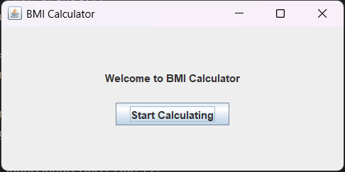
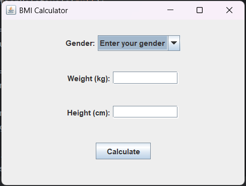
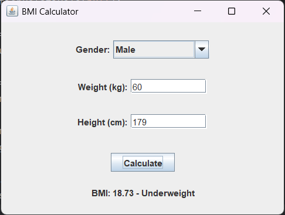
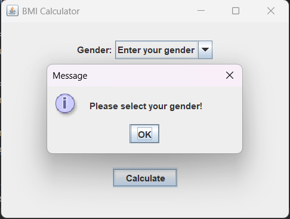

بعد از اجرای برنامه پنجره خوش آمد گویی نمایش داده میشود و دکمه Start Calculating نمایش داده میشود. در این پنجره از JPanel با BoxLayout عمودی استفاده شده
.

پس از زدن Start Calculating پنجره جدید نمایش داده میشود. این پنجره از JPanel با BoxLayout عمودی استفاده میکند و کاربر اطلاعات خود را وارد میکند
.

پس از زدن دکمه Calculate , BMI و وضعیت آن با توجه به جنسیت چاپ میشود
.

جنسیت بایستی وارد شود, در غیر اینصورت پیام ماسب نمایش داده میشود.

